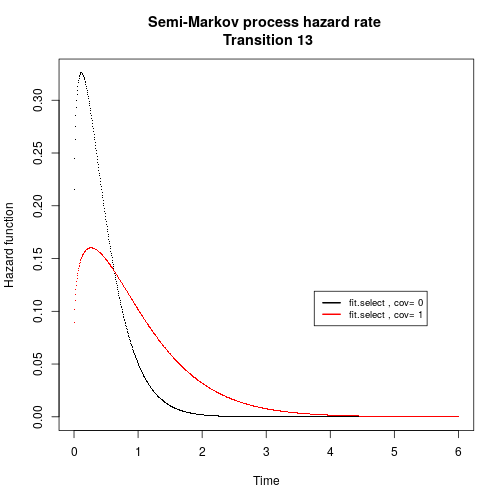
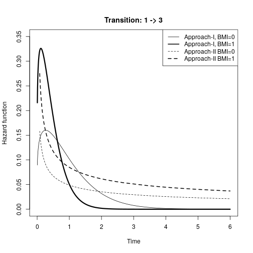
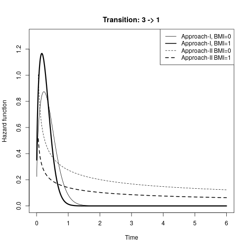
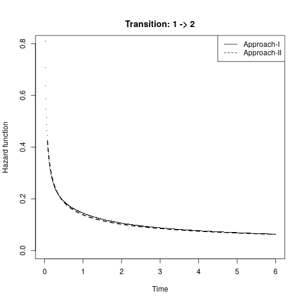
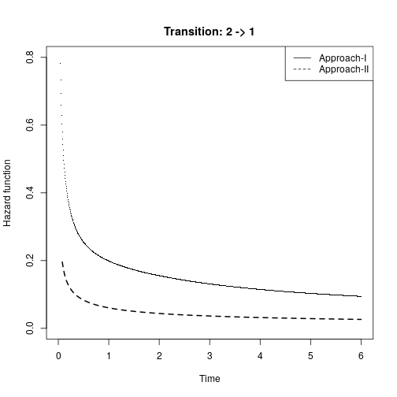
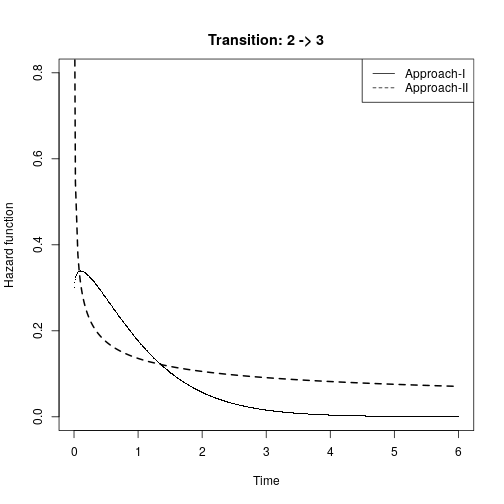
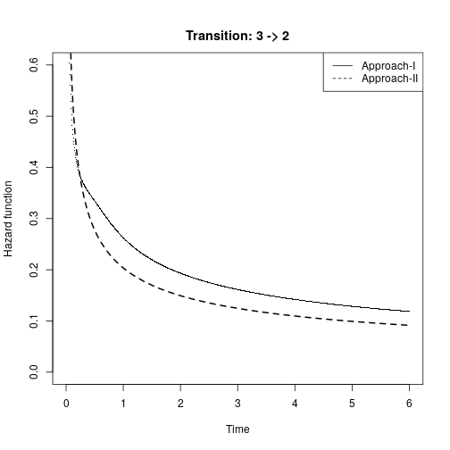

# Package used to reproduce results from our submitted article


```r
library(SemiMarkov)
library(flexsurv)
library(mstate)
source("plot_hazard_function_article.R")
```


# Data Analysis in Practice

## Load the data


```r
data("asthma", package = "SemiMarkov")
head(asthma)
```

```
  id state.h state.j       time Severity BMI Sex
1  2       3       2 0.15331964        1   1   0
2  2       2       2 4.12320329        1   1   0
3  3       3       1 0.09582478        1   1   1
4  3       1       3 0.22997947        1   1   1
5  3       3       1 0.26557153        1   1   1
6  3       1       1 5.40725530        1   1   1
```

```r
table.state(asthma)
```

```
$table.state
    1   2   3
1 152  95  44
2 112 116  71
3 115 120 103

$Ncens
[1] 371
```

## Reversible three states model


```r
states <- c("1", "2", "3")
mtrans <- matrix(FALSE, nrow = 3, ncol = 3)
mtrans[1, 2:3] <- c("W", "W")
mtrans[2, c(1, 3)] <- c("W", "W")
mtrans[3, c(1, 2)] <- c("W", "W")
```

We first consider a reversible three state model as in Krol and Saint pierre (2005). Three covariates are available in this study : severity (disease severity: coded 1 if severe, 0 if mild-moderate asthma), BMI (body mass index: 1 if BMI >= 25, 0 if BMI < 25) and sex (1 if men, 0 if women).

In this illustration we only use the BMI variable covariate and fit a first full parametric weibull semi-markov model using sojourn distribution approach.


```r
BMI <- as.data.frame(asthma$BMI)
fit <- semiMarkov(data = asthma, states = states, mtrans = mtrans,cov = BMI)
```

```

Iter: 1 fn: 1222.3252	 Pars:   9.38316  0.41810  5.01407  0.71352  2.23301  0.49838  0.53150  1.18049  0.51045  1.04824  0.49866  0.93146  0.83761  0.73769  0.62892 -0.27809 -0.87827  0.03221 -0.11152 -0.61129 -0.23909
Iter: 2 fn: 1222.3252	 Pars:   9.38375  0.41810  5.01356  0.71352  2.23302  0.49837  0.53148  1.18049  0.51046  1.04823  0.49865  0.93145  0.83761  0.73770  0.62892 -0.27808 -0.87827  0.03216 -0.11151 -0.61128 -0.23913
solnp--> Completed in 2 iterations
```

```r
fit$table.coef
```

```
  Type Index Transition Covariates Estimation   SD Lower_CI Upper_CI Wald_H0 Wald_test p_value
1 coef     1     1 -> 2      Beta1 -0.2780831 0.22    -0.72     0.16    0.00      1.55  0.2131
2 coef     2     1 -> 3      Beta1 -0.8782745 0.35    -1.57    -0.19    0.00      6.27  0.0123
3 coef     3     2 -> 1      Beta1  0.0321624 0.19    -0.35     0.41    0.00      0.03  0.8625
4 coef     4     2 -> 3      Beta1 -0.1115139 0.27    -0.64     0.41    0.00      0.17  0.6801
5 coef     5     3 -> 1      Beta1 -0.6112786 0.20    -1.00    -0.22    0.00      9.43  0.0021
6 coef     6     3 -> 2      Beta1 -0.2391296 0.21    -0.65     0.17    0.00      1.32  0.2506
```

```r
fit$minus2loglik
```

```
[1] 1222.325
```

```r
#fit$param.init
AIC.sojourn <- 2*(fit$minus2loglik+dim(fit$param.init)[1])
AIC.sojourn
```

```
[1] 2486.65
```

In this model, significant results of the BMI variables effet are found for the transition 1->3 and 3 <-1.
A simple model is then performed:

```r
BMI <- as.data.frame(asthma$BMI)
fit.select <- semiMarkov(data = asthma, states = states, mtrans = mtrans,cov = BMI,cov_tra = list(c("13","31")))
```

```

Iter: 1 fn: 1173.2915	 Pars:  11.19229  0.41772  4.89576  0.74508  0.27517  3.84564  0.53116  1.18028  0.51021  1.04553  1.43082  0.55567  0.83745  0.73811  0.34536 -0.88363 -0.44753
Iter: 2 fn: 1173.2915	 Pars:  11.19201  0.41772  4.89579  0.74508  0.27517  3.84565  0.53117  1.18028  0.51021  1.04554  1.43082  0.55566  0.83745  0.73811  0.34536 -0.88363 -0.44753
solnp--> Completed in 2 iterations
```

```r
fit.select$table.coef
```

```
  Type Index Transition Covariates Estimation   SD Lower_CI Upper_CI Wald_H0 Wald_test p_value
1 coef     1     1 -> 3      Beta1  -0.883628 0.35    -1.57    -0.20    0.00      6.34  0.0118
2 coef     2     3 -> 1      Beta1  -0.447529 0.20    -0.85    -0.05    0.00      4.84  0.0278
```

```r
fit.select$minus2loglik
```

```
[1] 1173.292
```

```r
#fit$param.init
AIC.sojourn.select <- 2*(fit.select$minus2loglik+dim(fit.select$param.init)[1])
AIC.sojourn.select
```

```
[1] 2380.583
```


one can visualise either the hazard rate of the sojourn time or the hazrad rate of the semi-markov process (i.e, intensity tranistion). We show this result for the transition 1->3

```r
plot(hazard(fit.select, cov = 0), hazard(fit, cov = 1), transitions = "13")
```


```r
plot(hazard(fit.select, cov = 0, type = "lambda"), hazard(fit.select, cov = 1,
    type = "lambda"), transitions = "13", legend.pos = c(3.75, 0.119),
 cex = 0.8)
```

```
[1] "1 1 0 1 6 6 0.212316322086668 0.983723083144297"
[1] "2 2 0 1 6 6 0.293147869337588 0.974572143177786"
[1] "3 3 0 1 6 6 1.62569997982739 0.980755828954354"
[1] "1 1 0 1 6 6 0.0880910613267103 0.984357583815064"
[1] "2 2 0 1 6 6 0.293147869337588 0.974572143177786"
[1] "3 3 0 1 6 6 1.62569997982739 0.981276799818962"
```




## Using Intensities transition  based approach

To use the intensity tranistion approach, we have first to get the data in a wide format shape. It has been done using the R file Data\_management\_illustration2.R.


```r
load("asthma-wide.Rdata")
levels(asthma.wide$trans) <- c("6","5","3","4","2","1")
```

### A full Weibull semi-Markov model on intensity tranistion 


```r
crwei.list <- vector(6, mode = "list")
AICfull <- 0
for (i in 1:6) {
crwei.list[[i]] <- flexsurvreg(Surv(years, status) ~ BMI,subset = (trans == i), data = asthma.wide, dist = "weibull")
AICfull <- AICfull+crwei.list[[i]]$AIC
}
crwei.list
```

```
[[1]]
Call:
flexsurvreg(formula = Surv(years, status) ~ BMI, data = asthma.wide, 
    subset = (trans == i), dist = "weibull")

Estimates: 
       data mean  est     L95%    U95%    se      exp(est)  L95%    U95%  
shape      NA      0.558   0.470   0.663   0.049      NA        NA      NA
scale      NA      9.741   5.956  15.930   2.445      NA        NA      NA
BMI     0.385      0.643  -0.148   1.433   0.403   1.901     0.862   4.192

N = 291,  Events: 95,  Censored: 196
Total time at risk: 624.8008
Log-likelihood = -244.0336, df = 3
AIC = 494.0671


[[2]]
Call:
flexsurvreg(formula = Surv(years, status) ~ BMI, data = asthma.wide, 
    subset = (trans == i), dist = "weibull")

Estimates: 
       data mean  est       L95%      U95%      se        exp(est)  L95%      U95%    
shape        NA     0.5360    0.4153    0.6919    0.0698        NA        NA        NA
scale        NA    87.3688   25.9220  294.4722   54.1628        NA        NA        NA
BMI      0.3849    -1.0331   -2.1660    0.0997    0.5780    0.3559    0.1146    1.1049

N = 291,  Events: 44,  Censored: 247
Total time at risk: 624.8008
Log-likelihood = -143.688, df = 3
AIC = 293.376


[[3]]
Call:
flexsurvreg(formula = Surv(years, status) ~ BMI, data = asthma.wide, 
    subset = (trans == i), dist = "weibull")

Estimates: 
       data mean  est      L95%     U95%     se       exp(est)  L95%     U95%   
shape       NA     0.5497   0.4714   0.6410   0.0431       NA        NA       NA
scale       NA     6.5976   4.1026  10.6098   1.5992       NA        NA       NA
BMI     0.4214    -0.0155  -0.7032   0.6723   0.3509   0.9847    0.4950   1.9588

N = 299,  Events: 112,  Censored: 187
Total time at risk: 463.7577
Log-likelihood = -231.9646, df = 3
AIC = 469.9291


[[4]]
Call:
flexsurvreg(formula = Surv(years, status) ~ BMI, data = asthma.wide, 
    subset = (trans == i), dist = "weibull")

Estimates: 
       data mean  est      L95%     U95%     se       exp(est)  L95%     U95%   
shape       NA     0.6376   0.5290   0.7685   0.0607       NA        NA       NA
scale       NA    12.1294   6.8093  21.6061   3.5729       NA        NA       NA
BMI     0.4214    -0.1750  -0.9135   0.5636   0.3768   0.8395    0.4011   1.7569

N = 299,  Events: 71,  Censored: 228
Total time at risk: 463.7577
Log-likelihood = -190.1011, df = 3
AIC = 386.2022


[[5]]
Call:
flexsurvreg(formula = Surv(years, status) ~ BMI, data = asthma.wide, 
    subset = (trans == i), dist = "weibull")

Estimates: 
       data mean  est     L95%    U95%    se      exp(est)  L95%    U95%  
shape      NA     0.5535  0.4768  0.6426  0.0421      NA        NA      NA
scale      NA     3.5510  2.2899  5.5067  0.7949      NA        NA      NA
BMI    0.4467     1.2097  0.4992  1.9203  0.3625  3.3526    1.6473  6.8231

N = 338,  Events: 115,  Censored: 223
Total time at risk: 403.9754
Log-likelihood = -210.3065, df = 3
AIC = 426.613


[[6]]
Call:
flexsurvreg(formula = Surv(years, status) ~ BMI, data = asthma.wide, 
    subset = (trans == i), dist = "weibull")

Estimates: 
       data mean  est      L95%     U95%     se       exp(est)  L95%     U95%   
shape       NA     0.6324   0.5486   0.7289   0.0458       NA        NA       NA
scale       NA     4.4129   2.8667   6.7931   0.9713       NA        NA       NA
BMI     0.4467     0.0923  -0.4742   0.6588   0.2890   1.0967    0.6224   1.9325

N = 338,  Events: 120,  Censored: 218
Total time at risk: 403.9754
Log-likelihood = -240.134, df = 3
AIC = 486.268
```

```r
AICfull
```

```
[1] 2556.455
```

### Same model full likelihood


```r
crwei <- flexsurvreg(Surv(years, status) ~ trans+shape(trans)+trans:BMI,data = asthma.wide, dist = "weibull")
crwei
```

```
Call:
flexsurvreg(formula = Surv(years, status) ~ trans + shape(trans) + 
    trans:BMI, data = asthma.wide, dist = "weibull")

Estimates: 
               data mean  est       L95%      U95%      se        exp(est)  L95%      U95%    
shape                NA    0.63232   0.54859   0.72882   0.04582        NA        NA        NA
scale                NA    4.41287   2.86659   6.79324   0.97130        NA        NA        NA
trans5          0.18211   -0.21763  -0.83296   0.39771   0.31395   0.80443   0.43476   1.48842
trans3          0.16110    0.40213  -0.23958   1.04384   0.32741   1.49501   0.78696   2.84011
trans4          0.16110    1.01109   0.29038   1.73180   0.36772   2.74859   1.33693   5.65081
trans2          0.15679    2.98563   1.69626   4.27500   0.65785  19.79902   5.45353  71.88018
trans1          0.15679    0.79179   0.13750   1.44608   0.33383   2.20733   1.14740   4.24642
trans6:BMI      0.08136    0.09257  -0.47398   0.65912   0.28906   1.09699   0.62252   1.93309
trans5:BMI      0.08136    1.21052   0.49972   1.92133   0.36266   3.35524   1.64825   6.83006
trans3:BMI      0.06789   -0.01547  -0.70322   0.67229   0.35090   0.98465   0.49499   1.95871
trans4:BMI      0.06789   -0.17496  -0.91350   0.56357   0.37681   0.83949   0.40112   1.75694
trans2:BMI      0.06034   -1.03314  -2.16598   0.09970   0.57799   0.35589   0.11464   1.10484
trans1:BMI      0.06034    0.64257  -0.14804   1.43318   0.40338   1.90137   0.86240   4.19203
shape(trans5)   0.18211   -0.13354  -0.33956   0.07249   0.10512   0.87499   0.71208   1.07518
shape(trans3)   0.16110   -0.13998  -0.34926   0.06931   0.10678   0.86938   0.70521   1.07177
shape(trans4)   0.16110    0.00834  -0.22625   0.24293   0.11969   1.00837   0.79752   1.27498
shape(trans2)   0.15679   -0.16517  -0.45729   0.12694   0.14904   0.84775   0.63300   1.13535
shape(trans1)   0.15679   -0.12435  -0.34733   0.09862   0.11376   0.88307   0.70657   1.10365

N = 1856,  Events: 557,  Censored: 1299
Total time at risk: 2985.068
Log-likelihood = -1260.228, df = 18
AIC = 2556.455
```

Same likelihood as it is the same model (see section 4.2 from our submitted article)


```r
#plot(crwei.list[[2]],type="hazard")
```

A semi-parametric model can be performed with mstate package to explore the shape of the intensity tranistion functions


```r
library(mstate)
tmat <- rbind(c(NA,1,2),c(3,NA,4),c(5,6,NA))
bcox <- coxph(Surv(years, status) ~ strata(trans)+BMI, data=asthma.wide)
mcox <- mstate::msfit(bcox, trans=tmat,newdata=data.frame(trans=rep(1:6,1),BMI=rep(0,6),strata=rep(1:6,1)))
mcox1 <- mstate::msfit(bcox, trans=tmat,newdata=data.frame(trans=rep(1:6,1),BMI=rep(1,6),strata=rep(1:6,1)))
```


```r
par(mfrow=c(3,2))
plot(mcox,type="sep",lwd=2)
par(mfrow=c(3,2))
plot(mcox1,type="sep",lwd=2)
```

### Plot the cumulative intensity transtion of 1-3 as example


```r
tgrid <- seq(0, 6, by = 0.1)
tmat <- rbind(c(NA,1,2),c(3,NA,4),c(5,6,NA))
mexp <- msfit.flexsurvreg(crwei.list, t=seq(0,6,by=0.1),newdata=data.frame(BMI=c(0)), trans=tmat)
mexp1 <- msfit.flexsurvreg(crwei.list, t=seq(0,6,by=0.1),newdata=data.frame(BMI=c(1)), trans=tmat)
```


```r
plot(mexp$Haz$Haz[mexp$Haz$trans==2]~mexp$Haz$time[mexp$Haz$trans==2], lwd=1, xlim=c(0, 6), ylim=c(0,0.6),type="l",ylab="cumulative hazard 1 -> 3",xlab="time")
lines(mexp1$Haz$time[mexp$Haz$trans==2], mexp1$Haz$Haz[mexp$Haz$trans==2],
             col="red", lwd=2, lty=2)
legend("topleft",legend=c("BMI=1 ","BMI=0"),lty=c(2,1),lwd=c(1,1),col=c("red","black"))
```

### Improve the weibull model

As BMI variable shows significant results only in transition 1-3 and 3-1, we simplify our model:


```r
crwei.list.select <- vector(6, mode = "list")
AICfull.select <- 0
set.simple <- c(1,3,4,6)
for (i in set.simple) {
crwei.list.select[[i]] <- flexsurvreg(Surv(years, status) ~ 1,subset = (trans == i), data = asthma.wide, dist = "weibull")
AICfull.select <- AICfull.select+crwei.list.select[[i]]$AIC
}
for (i in c(2,5)) {
crwei.list.select[[i]] <- flexsurvreg(Surv(years, status) ~ BMI,subset = (trans == i), data = asthma.wide, dist = "weibull")
AICfull.select <- AICfull.select+crwei.list[[i]]$AIC
}
crwei.list.select
```

```
[[1]]
Call:
flexsurvreg(formula = Surv(years, status) ~ 1, data = asthma.wide, 
    subset = (trans == i), dist = "weibull")

Estimates: 
       est      L95%     U95%     se     
shape   0.5590   0.4706   0.6640   0.0491
scale  12.1355   7.7143  19.0906   2.8052

N = 291,  Events: 95,  Censored: 196
Total time at risk: 624.8008
Log-likelihood = -245.3864, df = 2
AIC = 494.7728


[[2]]
Call:
flexsurvreg(formula = Surv(years, status) ~ BMI, data = asthma.wide, 
    subset = (trans == i), dist = "weibull")

Estimates: 
       data mean  est       L95%      U95%      se        exp(est)  L95%      U95%    
shape        NA     0.5360    0.4153    0.6919    0.0698        NA        NA        NA
scale        NA    87.3688   25.9220  294.4722   54.1628        NA        NA        NA
BMI      0.3849    -1.0331   -2.1660    0.0997    0.5780    0.3559    0.1146    1.1049

N = 291,  Events: 44,  Censored: 247
Total time at risk: 624.8008
Log-likelihood = -143.688, df = 3
AIC = 293.376


[[3]]
Call:
flexsurvreg(formula = Surv(years, status) ~ 1, data = asthma.wide, 
    subset = (trans == i), dist = "weibull")

Estimates: 
       est     L95%    U95%    se    
shape  0.5496  0.4714  0.6408  0.0431
scale  6.5583  4.4305  9.7080  1.3124

N = 299,  Events: 112,  Censored: 187
Total time at risk: 463.7577
Log-likelihood = -231.9655, df = 2
AIC = 467.931


[[4]]
Call:
flexsurvreg(formula = Surv(years, status) ~ 1, data = asthma.wide, 
    subset = (trans == i), dist = "weibull")

Estimates: 
       est      L95%     U95%     se     
shape   0.6362   0.5279   0.7667   0.0606
scale  11.3341   6.9596  18.4582   2.8202

N = 299,  Events: 71,  Censored: 228
Total time at risk: 463.7577
Log-likelihood = -190.208, df = 2
AIC = 384.416


[[5]]
Call:
flexsurvreg(formula = Surv(years, status) ~ BMI, data = asthma.wide, 
    subset = (trans == i), dist = "weibull")

Estimates: 
       data mean  est     L95%    U95%    se      exp(est)  L95%    U95%  
shape      NA     0.5535  0.4768  0.6426  0.0421      NA        NA      NA
scale      NA     3.5510  2.2899  5.5067  0.7949      NA        NA      NA
BMI    0.4467     1.2097  0.4992  1.9203  0.3625  3.3526    1.6473  6.8231

N = 338,  Events: 115,  Censored: 223
Total time at risk: 403.9754
Log-likelihood = -210.3065, df = 3
AIC = 426.613


[[6]]
Call:
flexsurvreg(formula = Surv(years, status) ~ 1, data = asthma.wide, 
    subset = (trans == i), dist = "weibull")

Estimates: 
       est     L95%    U95%    se    
shape  0.6313  0.5478  0.7275  0.0457
scale  4.6290  3.3487  6.3988  0.7647

N = 338,  Events: 120,  Censored: 218
Total time at risk: 403.9754
Log-likelihood = -240.1852, df = 2
AIC = 484.3703
```

```r
AICfull.select
```

```
[1] 2551.479
```


## Visualize comparison of Sojourn times and Intensity transition approaches

We plot the hazard rate of the semi-markov process using both approaches


```r
plot.hazard.benoit(hazard(fit.select, cov = 0, type = "lambda"), hazard(fit.select, cov = 1,
    type = "lambda"),colors=c("black","black"), transitions = "13",cex =c(0.8,3),lty=c(1,1),ylim=c(0,0.35),lwd=c(3,1),legend=FALSE,type=c("l","l"),title_paper="Transition: 1 -> 3")#, legend.pos = c(3.75, 0.3),cex = 0.8)
```

```
[1] "1 1 0 1 6 6 0.212316322086668 0.983723083144297"
[1] "2 2 0 1 6 6 0.293147869337588 0.974572143177786"
[1] "3 3 0 1 6 6 1.62569997982739 0.980755828954354"
[1] "1 1 0 1 6 6 0.0880910613267103 0.984357583815064"
[1] "2 2 0 1 6 6 0.293147869337588 0.974572143177786"
[1] "3 3 0 1 6 6 1.62569997982739 0.981276799818962"
```

```r
lines(crwei.list.select[[2]],type="hazard",newdata =data.frame(BMI=0),col="black",ci=FALSE,lty=2,lwd=1)
lines(crwei.list.select[[2]],type="hazard",newdata =data.frame(BMI=1),col="black",ci=FALSE,lty=2,lwd=2)
legend("topright",legend=c("Approach-I, BMI=0","Approach-I, BMI=1","Approach-II BMI=0","Approach-II BMI=1"),lty=c(1,1,2,2),lwd=c(1,2,1,2))
```



```r
dev.print(pdf,"hazard_13.pdf")
```

```
png 
  2 
```


```r
plot.hazard.benoit(hazard(fit.select, cov = 0, type = "lambda"), hazard(fit.select, cov = 1,
    type = "lambda"),colors=c("black","black"), transitions = "31",cex =c(0.8,3),lty=c(1,1),ylim=c(0,1.3),lwd=c(3,1),legend=FALSE,type=c("l","l"),title_paper="Transition: 3 -> 1")#, legend.pos = c(3.75, 0.3),cex = 0.8)
```

```
[1] "1 1 0 1 6 6 0.212316322086668 0.983723083144297"
[1] "2 2 0 1 6 6 0.293147869337588 0.974572143177786"
[1] "3 3 0 1 6 6 1.62569997982739 0.980755828954354"
[1] "1 1 0 1 6 6 0.0880910613267103 0.984357583815064"
[1] "2 2 0 1 6 6 0.293147869337588 0.974572143177786"
[1] "3 3 0 1 6 6 1.62569997982739 0.981276799818962"
```

```r
lines(crwei.list.select[[5]],type="hazard",newdata =data.frame(BMI=0),col="black",ci=FALSE,lty=2,lwd=1)
lines(crwei.list.select[[5]],type="hazard",newdata =data.frame(BMI=1),col="black",ci=FALSE,lty=2,lwd=2)
legend("topright",legend=c("Approach-I, BMI=0","Approach-I, BMI=1","Approach-II BMI=0","Approach-II BMI=1"),lty=c(1,1,2,2),lwd=c(1,2,1,2))
```



```r
dev.print(pdf,"hazard_31.pdf")
```

```
png 
  2 
```


```r
plot.hazard.benoit(hazard(fit.select, type = "lambda"), transitions = "12",cex =c(0.8),lty=c(1),legend=FALSE,ylim=c(0,0.8),title_paper="Transition: 1 -> 2")#, legend.pos = c(3.75, 0.3),cex = 0.8,ylim)
```

```
[1] "1 1 0 1 6 6 0.212316322086668 0.983723083144297"
[1] "2 2 0 1 6 6 0.293147869337588 0.974572143177786"
[1] "3 3 0 1 6 6 1.62569997982739 0.980755828954354"
```

```r
lines(crwei.list.select[[1]],type="hazard",ci=FALSE,lty=2,col="black")
legend("topright",legend=c("Approach-I","Approach-II"),lty=c(1,2))
```



```r
dev.print(pdf,"hazard_12.pdf")
```

```
png 
  2 
```


```r
plot.hazard.benoit(hazard(fit.select, type = "lambda"), transitions = "21",cex =c(0.8),lty=c(1),legend=FALSE,ylim=c(0,0.8),title_paper="Transition: 2 -> 1")#, legend.pos = c(3.75, 0.3),cex = 0.8,ylim)
```

```
[1] "1 1 0 1 6 6 0.212316322086668 0.983723083144297"
[1] "2 2 0 1 6 6 0.293147869337588 0.974572143177786"
[1] "3 3 0 1 6 6 1.62569997982739 0.980755828954354"
```

```r
lines(crwei.list.select[[2]],type="hazard",ci=FALSE,lty=2,col="black")
legend("topright",legend=c("Approach-I","Approach-II"),lty=c(1,2))
```



```r
dev.print(pdf,"hazard_21.pdf")
```

```
png 
  2 
```

```r
plot.hazard.benoit(hazard(fit.select, type = "lambda"), transitions = "23",cex =c(0.8),lty=c(1),legend=FALSE,ylim=c(0,0.8),title_paper="Transition: 2 -> 3")#, legend.pos = c(3.75, 0.3),cex = 0.8,ylim)
```

```
[1] "1 1 0 1 6 6 0.212316322086668 0.983723083144297"
[1] "2 2 0 1 6 6 0.293147869337588 0.974572143177786"
[1] "3 3 0 1 6 6 1.62569997982739 0.980755828954354"
```

```r
lines(crwei.list.select[[4]],type="hazard",ci=FALSE,lty=2,col="black")
legend("topright",legend=c("Approach-I","Approach-II"),lty=c(1,2))
```



```r
dev.print(pdf,"hazard_23.pdf")
```

```
png 
  2 
```


```r
plot.hazard.benoit(hazard(fit.select, type = "lambda"), transitions = "32",cex =c(0.8),lty=c(1),legend=FALSE,ylim=c(0,0.6),title_paper="Transition: 3 -> 2")#, legend.pos = c(3.75, 0.3),cex = 0.8,ylim)
```

```
[1] "1 1 0 1 6 6 0.212316322086668 0.983723083144297"
[1] "2 2 0 1 6 6 0.293147869337588 0.974572143177786"
[1] "3 3 0 1 6 6 1.62569997982739 0.980755828954354"
```

```r
lines(crwei.list.select[[5]],type="hazard",ci=FALSE,lty=2,col="black")
legend("topright",legend=c("Approach-I","Approach-II"),lty=c(1,2))
```



```r
dev.print(pdf,"hazard_32.pdf")
```

```
png 
  2 
```

